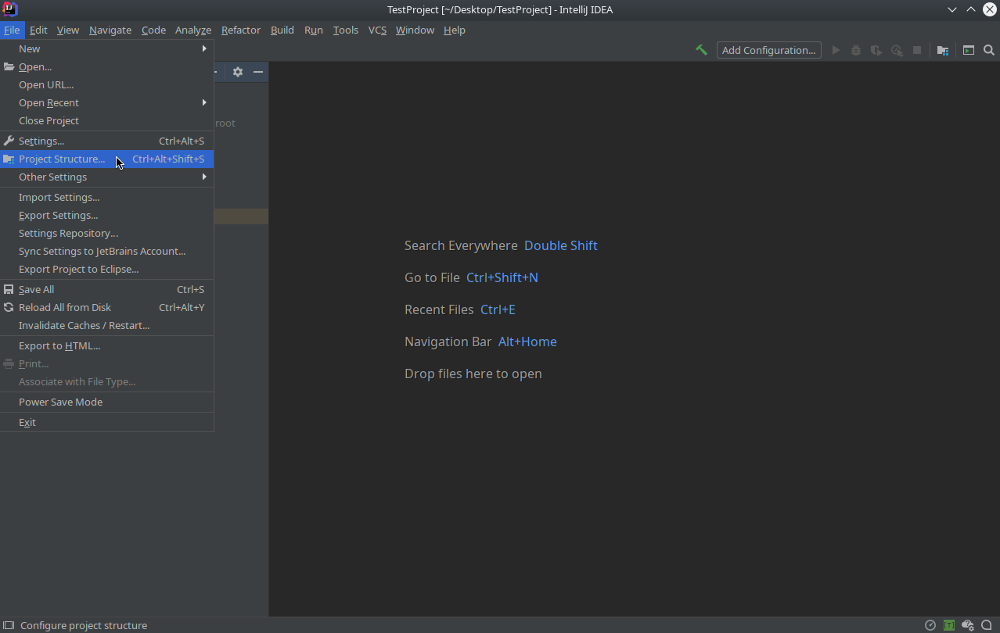
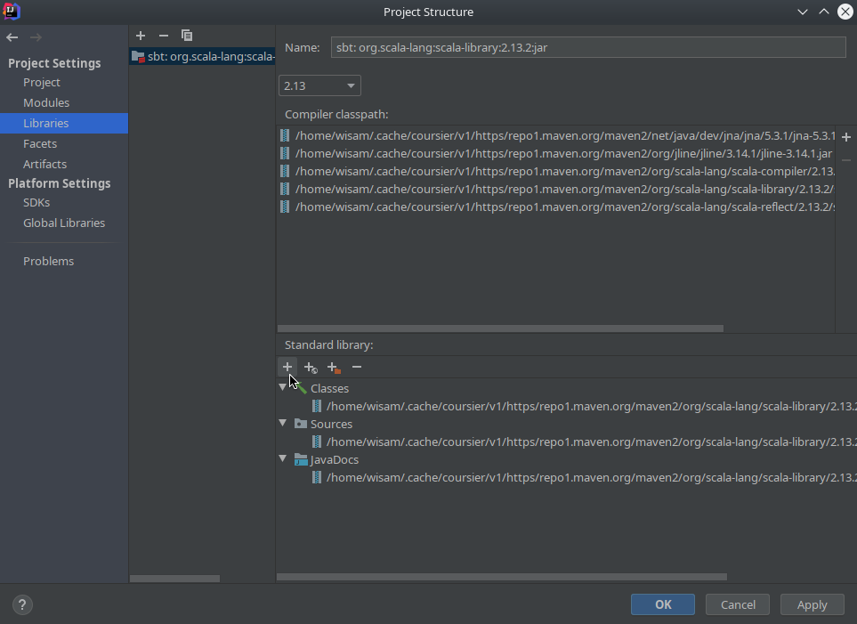
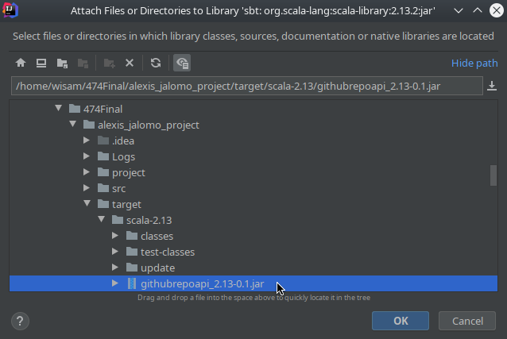
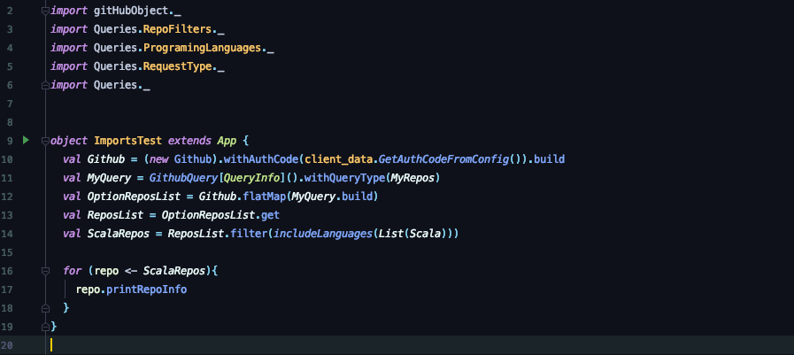

# GraphQL Client Framework for GitHub
Wisam Abunimeh  
Alex Jalomo  
Jacob Sanchez  
CS474, Spring 2020

## Description  
This project is a pure functional object-oriented design framework for composing and executing external GraphQL commands from Scala client programs. The framework obtains and processes the results of these executions. Results are processed by extracting and organizing git repository data, in relation to the GitHub developer schema, via a lightweight JSON parser.


## Installation

To use this framework, be sure to have the following software installed:  

* [Java SE Development Kit 11](https://www.oracle.com/java/technologies/javase-jdk11-downloads.html)
* [sbt 1.3.x ](https://www.scala-sbt.org/download.html)
* [Scala  2.13.x](https://www.scala-lang.org/download/) 
* [IntelliJ IDEA](https://www.jetbrains.com/idea/download/)
* GraphQL Client Framework for Github

To install this package into a project:  

1.  Download GraphQL Client Framework for Github

    ```  
    git clone https://bitbucket.org/Jalomo1197/alexis_jalomo_project/
    ```
	
2. Navigate to the project root folder  

    ```
    cd alexis_jalomo_project/  
    ```
    
3. Execute these commands on the command line:

    ```
    sbt clean  
    ```  
    ```
    sbt package
    ```
    
4. Open your project in IntelliJ IDEA and navigate to File → Project Structure  


5. Under the Project Settings tab, select Libraries. Select Add under Standard Library  


6. Navigate to `./alexis_jalomo_project/target/scala-2.13/` and select `githubrepoapi_2.13-0.1.jar`  
  
Apply the changes. The package will now be usable within the user's project.


## Usage Details

#### Configuration

Place your [GitHub access token](https://help.github.com/en/github/authenticating-to-github/creating-a-personal-access-token-for-the-command-line) in the configuration file loacted here: `./alexis_jalomo_project/src/main/resources/lightbend.conf` 

    githubAPI {
     key = "your github access token here"
    }

### Usage Help

Three Phases:

* Create a GitHub object
* Create a Query  
* Apply Query to the GitHub object

### Create the GithubObject

    val Github = (new  Github).withAuthCode(client_data.GetAuthCodeFromConfig()).build //Specific user object
    
### Create Query

When building a query, the `RequestType` is strictly required. (see Query Commands).
Query must be built `withQueryType` to enter `RequestType`.

    GithubQuery[QueryInfo]().withQueryType(/*Desired Query Type*/)

#### RequestType

* MyRepos
* MyContributedToRepos
* SpecificUser


### Apply Query to Github Object

Below is an example of creating a Query of `SpecificUser` type.

    val  SpecificUserQuery  =  Github[QueryInfo]().withQueryType(SpecificUser).withSpecificUser("wisabi")
    val  SpecificUserList  = Github.flatMap(SpecificUserQuery.build)
    val  UserList  =  SpecificUserList.get

#### Applying Query to Github Object


The GitHub object when invoked via flatMap will respond to the Query and return a String in relation to the [GitHub Developer Schema](https://developer.github.com/v4/public_schema/). The response is passed to the builder for whichever RequestType is invoked. The builder applies all filters based on the `RequestType` chosen. The Query built is passed to the GitHub object and returns type: 

    Option[Seq[Repo]]

The Query builder return type is wrapped in an Option to handle cases where user repositories are empty.

#### Acquire wanted data from a list of repositories.

An example to get a list of languages for a specific user:

    for (x <- UserList){
	    println("ProgramingLanguages: ")
	    println(x.getLanguages)
    }


## Commands
### Query Commands

There exist three supported query types for the GitHub’s API. The desired type must be specified during the creation of the Query.

```
GithubQuery[QueryInfo]().withQueryType(/*Desired Query Type*/)
```

Query types MyRepos and MyContributedToRepos are relative to the owner of the GitHub authorization key.

#### MyRepos
This query type is meant to retrieve the user’s first 100 repositories. 

```
GithubQuery[QueryInfo]().withQueryType(MyRepos)
```

#### MyContributedToRepos
This query type is meant to retrieve the user’s first 100 contributed to repositories.

```
GithubQuery[QueryInfo]().withQueryType(MyContributedToRepos)
```

#### SpecificUser
This query type is meant to retrieve the first 100 repositories of a specified user. If no user is specified (meaning withSpecificUser was not called), then the query type is changed to MyRepos when sent to GitHub’s API.

```
GithubQuery[QueryInfo]().withQueryType(SpecificUser).withSpecificUser(“jalomo1197”)
```

### Repo Commands
Once the collection of repositories is obtained, there are two types of commands that can be made. 

#### Access-type commands 
##### Functions:
* ```getCollaborators: List[Collaborators]```  
 Returns the collaborators of the repository (empty if user does not have push rights)
    
* ```getPullRequests: List[PullRequestsList]```  
 Returns the 10 most recent pull requests of the repository
 
* ```getLanguages: List[String]```  
  Returns the programming languages used for the repository
  
* ```getPrimaryLanguage: String```  
 Returns the primary language of the repository
 
* ```getStarGazersCount: Int```  
 Returns the amount of star grazers the repository has
 
* ```getCommitCommentsCount: Int```  
 Returns the amount of commit comments the repository has
 
* ```printRepoInfo: Unit```  
 Prints information about the repository

##### Relevant Repo fields:
* ```Repo.repoName```  
 Repository’s name  
 
* ```Repo.nameWithOwner```   
 Repository’s name with owner

* ```Repo.createdDate```  
 Repository’s creation date
 
* ```Repo.lastPushed```  
 Repository’s last pushed date

* ```Repo.description```  
 Repository’s description (null if repository has no description on github)

#### Filter-type commands
The filter-type commands are meant to be used for filtering a collection of repositories. These functions are meant to be partially called inside a filter call 

    // Set Up
    Val MyQuery = GithubQuery[QueryInfo]().withQueryType(MyRepos)
    Val OptionReposList: Option[Seq[Repo]] = github.flatMap(MyQuery.build)
    Val ReposList: Seq[Repo] = OptionReposList.get
    // Filtering
    Val ScalaRepos: Seq[Repo] = ReposList.filter(/* partial function call */)

You can also add desired filters during the construction of the GithubQuery like so:

    Val MyQuery = GithubQuery[QueryInfo]().withQueryType(MyRepos).withFilter(/*func call */)


### Partial function calls supported:

Filter to obtain all repositories that include Scala code:

    includeLanguages(languages: List[ProgrammingLanguages.Languages])

Filter to obtain all repositories that have at least a certain amount of pulls:

    MinimumPulls(amount: Int)
    
Filter to obtain all repositories that have at most a certain amount of pulls:

    MaxPulls(amount: Int)


Filter to obtain all repositories that have at least a certain amount of forks:

    MinimumForks(amount: Int)

Filter to obtain all repositories that have at most a certain amount of forks:

    MaxForks(amount: Int)


Filter to obtain all repositories that have a description:
 
    NonNullDescriptions

Filter to obtain all repositories that have a null description:

    NullDescriptions

Filter to obtain all repositories that were created on a specified day:

    createdOnNthDay(year: Int, month: Int, day: Int)

Filter to obtain all repositories that were created before a specified day:

    createdBeforeDate(year: Int, month: Int, day: Int)

Filter to obtain all repositories that were created after a specified day:

    createdAfterDate(year: Int, month: Int, day: Int)

## Demo
### Input

### Output

## Testing
To execute the unit tests from the command line, execute the following commands:  

```
cd alexis_jalomo_project/  
sbt clean
sbt compile
sbt test
```
Once the tests has completed, the testing report appears here:  `./alexis_jalomo_project/target/test-reports/index.html` 

## Limitations

Query requests must pass [Github GraphQL API v4 schema validations](https://developer.github.com/v4/guides/resource-limitations/).

### Node Limit

Individual calls cannot request more than 500,000 Nodes

### Rate Limit

GraphQL API v4 rate limit is 5,000 points per hour

## Logging
Log files can be found in the ./alexis_jalomo_projec/Logs directory. Log files follow the log-YYYY-MM-DD.log naming format.

## Open Source Tools
The following open source tools and their documentation were used for this project:  

* [JSON4S](https://github.com/json4s/json4s)
* [Apache HttpComponents](https://hc.apache.org/)
* [Typesafe Config ](https://github.com/lightbend/config)
* [ScalaTest](http://www.scalatest.org/)
* [Logback](http://logback.qos.ch/)
* [Scala Logging](https://github.com/lightbend/scala-logging)
* [Transform](https://transform.tools/json-to-scala-case-class)

## References  
The following resources were used:  

* [GraphQL API v4](https://developer.github.com/v4/) 
* [Stack Overflow](https://stackoverflow.com/)
* [Scala Language Specification](https://scala-lang.org/files/archive/spec/2.11/)
* [Functional Programming in Scala](https://www.oreilly.com/library/view/functional-programming-in/9781617290657/)
* [sbt Reference Manual](https://www.scala-sbt.org/1.x/docs/)

